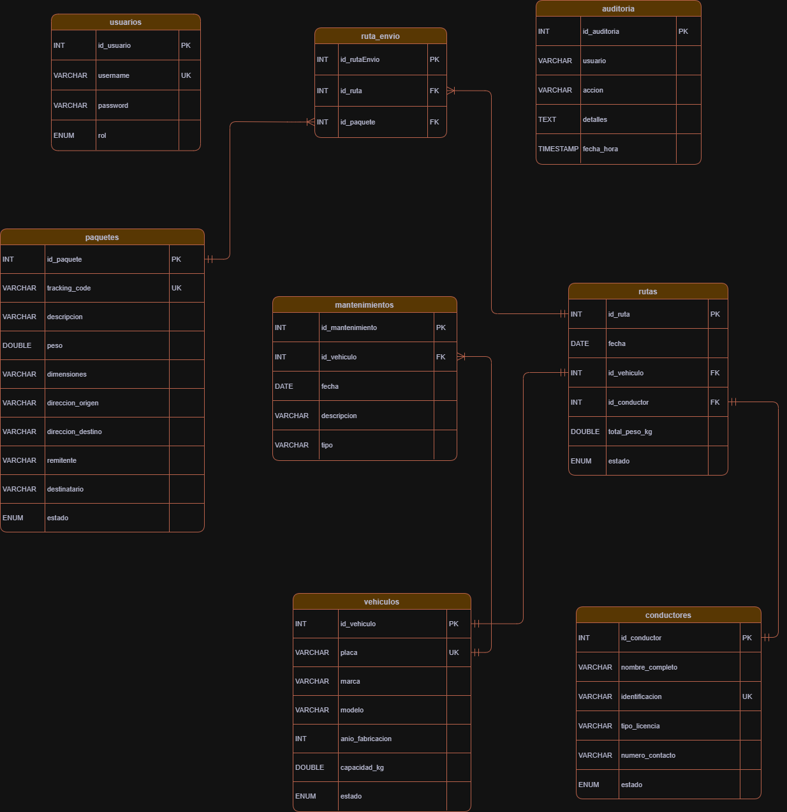

# 🚚 RapidExpress  
### Sistema de Gestión Logística — Java | MVC | DAO | MySQL


---

## 📋 Descripción del Proyecto

**RapidExpress** es un sistema de gestión logística desarrollado en **Java**, que facilita la administración de procesos de transporte, distribución y control de envíos en empresas de mensajería. Implementa patrones de arquitectura **MVC (Modelo–Vista–Controlador)** y **DAO (Data Access Object)**, lo que asegura escalabilidad, orden de código y facilidad para mantenimiento y expansión hacia aplicaciones web o móviles futuras.

El sistema llega para optimizar la gestión de activos logísticos y recursos humanos, incrementar la trazabilidad y control de los envíos, y potenciar la toma de decisiones mediante registros confiables y procesos auditados.

---

## 🎯 Objetivo del Proyecto

Optimizar la operativa logística en empresas de mensajería permitiendo:

- Administración de vehículos, rutas, conductores y envíos.
- Registro completo de mantenimientos preventivos y correctivos.
- Control de usuarios y roles, para una gestión segura.
- Auditoría interna de procesos críticos.
- Generación de reportes que ayudan a la toma de decisiones.

---

## 🛠️ Tecnologías Utilizadas

| Tecnología       | Propósito                         |
|------------------|----------------------------------|
| **Java SE 17+**  | Lógica y estructura principal     |
| **MySQL**        | Base de datos relacional local    |
| **JDBC**         | Conectividad BD                   |
| **MVC**          | Separación de capas               |
| **DAO**          | Gestión robusta de datos          |
| **Git/GitHub**   | Control de versiones              |
| **NetBeans**     | Desarrollo e integración          |
| **CLI**          | Interfaz por consola              |

---

## 🗄️ Diseño de la Base de Datos

La base de datos de **RapidExpress** está normalizada y estructurada para eficiencia y escalabilidad.  
**Nota:** El sistema opera con una base de datos local gestionada en **DBeaver**. Los scripts SQL necesarios se encuentran en la carpeta `/database/` del proyecto.

### Entidades principales del modelo relacional

- 🚗 Vehículos: datos de placa, estado, capacidad.
- 👷 Conductores: información personal, licencia, estado.
- 📦 Paquetes/Envios: datos de envío, tracking, estado, dimensiones.
- 🛣️ Rutas: definición de trayecto, fecha, vehículo y conductor asignados.
- 🔄 Ruta_Envios (N:M): asociaciones entre rutas y envíos.
- 🔧 Mantenimientos: historial para vehículos.
- 👤 Usuarios: credenciales y roles.
- 📝 Auditoría: seguimiento de la actividad del sistema.

#### Valores controlados por ENUM:

- `EstadoVehiculo`
- `EstadoConductor`
- `EstadoEnvio`
- `EstadoRuta`
- `RolUsuario`

---

### 📈 Diagrama UML

<div align="center">
  
</div>

---

## 🏗️ Arquitectura del Proyecto

```plaintext
└── src/
    └── main/
        └── java/
            └── com/
                └── rapidexpress/
                    ├── RapidExpress.java                         # Clase principal CLI
                    ├── config/
                    │   └── ConexionBD.java                          # Conexión JDBC
                    ├── controller/
                    │   ├── AuditoriaController.java
                    │   ├── ConductorController.java
                    │   ├── MantenimientoController.java
                    │   ├── PaqueteController.java
                    │   ├── RutaController.java
                    │   ├── UsuarioController.java
                    │   └── VehiculoController.java
                    ├── dao/
                    │   ├── interfaces/
                    │   │   ├── AuditoriaDAO.java
                    │   │   ├── ConductorDAO.java
                    │   │   ├── MantenimientoDAO.java
                    │   │   ├── PaqueteDAO.java
                    │   │   ├── RutaDAO.java
                    │   │   ├── UsuarioDAO.java
                    │   │   └── VehiculoDAO.java
                    │   └── implementation/
                    │       ├── AuditoriaDAOImpl.java
                    │       ├── ConductorDAOImpl.java
                    │       ├── MantenimientoDAOImpl.java
                    │       ├── PaqueteDAOImpl.java
                    │       ├── RutaDAOImpl.java
                    │       ├── UsuarioDAOImpl.java
                    │       └── VehiculoDAOImpl.java
                    ├── model/
                    │   ├── Auditoria.java
                    │   ├── Conductor.java
                    │   ├── Mantenimiento.java
                    │   ├── Paquete.java
                    │   ├── Ruta.java
                    │   ├── Usuario.java
                    │   ├── Vehiculo.java
                    │   └── enums/
                    │       ├── EstadoConductor.java
                    │       ├── EstadoPaquete.java
                    │       ├── EstadoRuta.java
                    │       ├── EstadoVehiculo.java
                    │       └── RolUsuario.java
                    ├── service/
                    │   ├── ServicioAuditoria.java
                    │   ├── ServicioConductor.java
                    │   ├── ServicioMantenimiento.java
                    │   ├── ServicioPaquete.java
                    │   ├── ServicioRuta.java
                    │   ├── ServicioUsuario.java
                    │   └── ServicioVehiculo.java
                    └── view/
                        ├── MenuPrincipalCLI.java
                        ├── MenuTrabajadorCLI.java
                        ├── UsuarioCLI.java
                        └── util/
                            ├── CLIUtils.java
                            └── TrackingCodeGenerator.java
```

---

## 🚀 Instalación y Ejecución

#### Requisitos previos
- **Java 17+**
- **MySQL Server local**
- **DBeaver**
- **NetBeans IDE** (opcional) o terminal

#### Pasos para instalar y ejecutar el sistema

1. **Clona el repositorio**
   ```bash
   git clone https://github.com/JhoanS5/RapidExpress_.git
   ```
2. **Configuración de la base de datos**
   - Abre **DBeaver** y crea una base de datos llamada `rapidexpress`.
   - Ejecuta los scripts `.sql` ubicados en la carpeta `/database/` para generar todas las tablas y relaciones necesarias.

3. **Configuración de conexión**
   - Verifica y ajusta los parámetros de conexión a tu base de datos MySQL en el archivo:
     ```
     src/main/java/com/rapidexpress/config/ConexionBD.java
     ```
   - Ejemplo de valores:
     ```java
     String url      = "jdbc:mysql://localhost:3306/rapidexpress";
     String user     = "tu_usuario_mysql";
     String password = "tu_contraseña_mysql";
     ```
---

## 📖 Guía de Uso

El sistema opera mediante menús interactivos en la terminal (CLI):

1. **Inicio de sesión:** Ingresa con usuario y contraseña.
2. **Menú Principal:** Dependiendo del rol, accede a distintas funciones administrativas y operativas.
3. **Gestión de vehículos:** Registro, modificación, consulta y mantenimiento.
4. **Gestión de conductores:** Asignación y perfil de empleados.
5. **Registro de envíos y rutas:** Crea rutas, asocia paquetes y gestiona el flujo de envíos.
6. **Auditoría interna:** Consulta historiales y acciones del sistema.

#### Ejemplo rápido de flujo de operación

```plaintext
Bienvenido a RapidExpress
1) Iniciar sesión
Ingrese usuario: admin
Ingrese clave: ********

--- Menú principal ---
1) Vehículos
2) Conductores
3) Paquetes
4) Rutas
5) Mantenimientos
6) Auditoría
0) Salir
```
## 📂 Scripts y Archivos de Base de Datos

- Todos los scripts SQL están disponibles en la carpeta `/database`.
  - `database/1_schema_ddl.sql`
  - `database/2_data_dml.sql`
- Puedes modificarlos según tu configuración y volver a ejecutarlos desde **DBeaver**.

---

## Examen Java

- Requerimiento Detallado

Deberás extender la funcionalidad actual de los vehículos para incorporar los nuevos tipos y sus reglas de negocio asociadas.

Creación de Tipos Especializados: El sistema ahora debe reconocer dos nuevos tipos de vehículos: "Motocicleta" y "Camión". Estos deben compartir las características comunes de un vehículo existente (placa, marca, capacidad, etc.), pero también tener sus propias particularidades.


Reglas de Validación Específicas: Cada tipo de vehículo debe tener su propio método para validar si puede transportar un paquete determinado. Para este ejercicio, la regla es:

    Las motocicletas no pueden transportar paquetes que pesen más de 25 kg.
    Los camiones, por ahora, no tienen restricciones adicionales más allá de las generales del vehículo.

Se agrego la validaciones dichas en el enunciado

## 👥 Autores

**Jhoan Diaz** | [JhoanS5](https://github.com/JhoanS5) 

**Dumas Restrepo** | [DumasRestrepo](https://github.com/DumasRestrepo)

**Manuel Galvis** | [DevManuelGalvis](https://github.com/DevManuelGalvis)             

**Freddy Ramon** | [FreddyR03](https://github.com/FreddyR03)   
